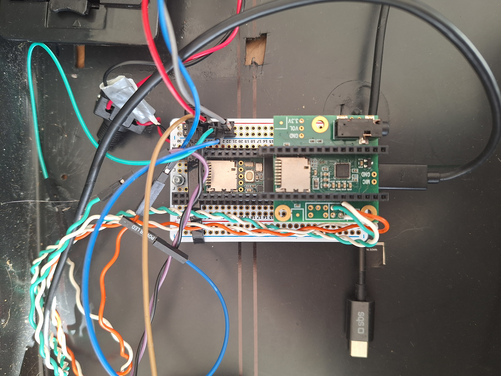
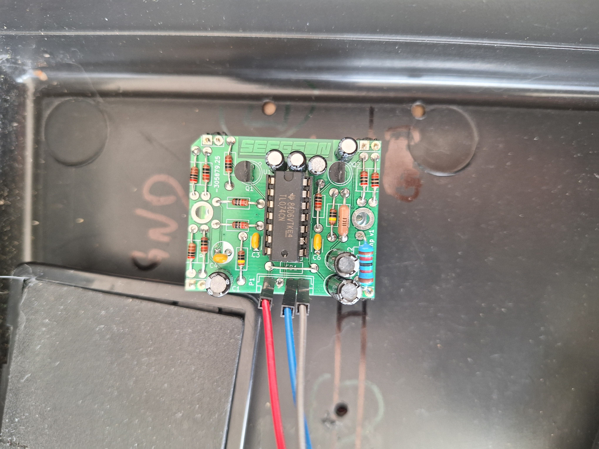
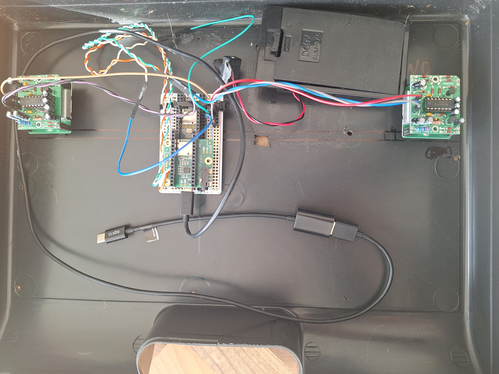
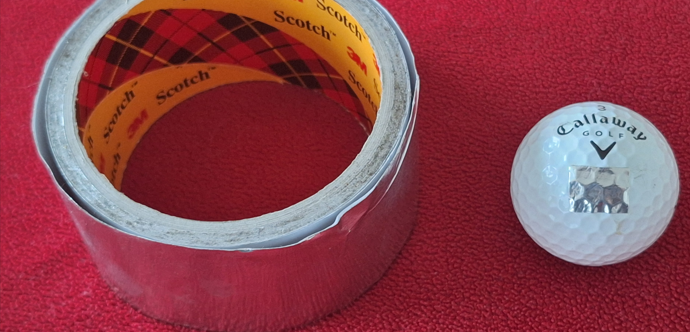

# Golf Ball Simulator in Scilab (java and cpp)

## Flight Analyzer captured by little Radars

# Find backspin

Given d = 0.04267m

 V = F / 19,48
 
rpm = 1000*(F_sommet - F_balle)/(19.48*60*%pi*d)

As mesured and as seen above, we can see that the ball speed is around 160km/h and the maximum echo is 191km/h.
So that the backspin could be estimated as 3854rpm.

## The HW
### The suitecase

### Arduino

###

###

### Aluminium Patch
Place aluminum tape to increase the surface area of ​​the radar echo.

## Simples Scilab Commands
exec('GolfBall-master\sci\comet3d2.sci', -1)
exec('GolfBall-master\sci\FFT_Mat.sce', -1)
exec('GolfBall-master\sci\Golfball.sci', -1)

fichier = uigetfile("*.wav", "Golf\Radar\");[x,Fs,bits]=wavread(fichier);
[x,Fs,bits]=wavread(fichier); 

Or 

[x,Fs,bits]=wavread('2019-02-24-F7-123m-150kmh-5274trm-210trm-cs111.wav');

Then

xg = x(1,1:$);
xd = x(2,1:$);

[xgCentre, xgf] = plotFFT(xg,Fs);
[xdCentre, xdf] = plotFFT(xd,Fs);

[tt5,f5,M5]=animFFT(xgf,44100, 128 ,2 , 2,0);
[tt5,f5,M5]=animFFT(xdf,44100, 128 ,2 , 2,0);

[M5,tt5,f5]=animDensite(xgf,44100, 512 ,10 , 1, 0.0010,1);
[vBall, vClub, SmashFactor,thetaLoft, ShafLeanImp, launchAngle, SpinZ] = Info(M5,f5,Club)

[M5,tt5,f5]=animDensite(xdf,44100, 512 ,10 , 1, 0.0010,1);
[vBall, vClub, SmashFactor,thetaLoft, ShafLeanImp, launchAngle, SpinZ] = Info(M5,f5,Club)

[M5,tt5,f5]=animDensite3(xgf,44100, 512 ,10 , 1, 100,1);

[vClub, vBall, SmashFactor,thetaLoft, ShafLeanImp, launchAngle, SpinZ] = Info2((xgf),'7',44100)
[vClub, vBall, SmashFactor,thetaLoft, ShafLeanImp, launchAngle, SpinZ] = Info2((xdf),'7',44100)

alphaClubPath=0;
gamaFacePath=0;
[t,VOL,Res] = Golfball(18, vClub, '7', alphaClubPath,gamaFacePath,ShafLeanImp ,1);
